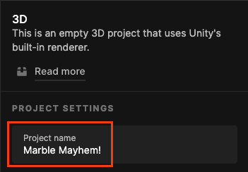

## Your idea

You can build on any of your previous Design or Explore projects, or if you have enough time you can start a completely new project. 

Use this step to plan your project. You can plan by just thinking, tinkering, drawing, or writing, or however you like!

{:width="300px"}

"The obvious objective of video games is to entertain people by surprising them with new experiences." Shigeru Miyamoto, Creator of Super Mario Bros

### What are you making?

--- task ---

What type of project are you going to create? Is the goal to challenge the player or to show them a beautiful world they can play around in?

It could be:
- A game with obstacles and a defined goal
- An art piece, allowing the player to explore the world you have created
- A playground for players to experience the physics inside of Unity

--- /task ---

### Who is it for?

--- task ---

Think about who you will make your project for (your **audience**).

- Do they play lots of games already?
- What would they be looking for in a game or art piece?
- How will you make them want to explore the project you have created?

--- /task ---

### Game design or experience design

"Games, when you play them with other people, … actually strengthen the reward circuitry so it actually makes people more social and more likely to collaborate because their brains are actually more responsive to people online and offline. Games are transforming the brains of people who play them in largely positive ways." Jane Mcgonigal, Director of game research and development for the Institute for the Future

Think about the skills you have gained in this pathway and how you will use them to create your project:
- What will your level look like, will it be a track, a tiled floor or a combination of the two?
- How will the player control the ball, directly or by tilting the world?
- Will there be more than one player? Which keys will you use for them?
- What obstacles will you put in your player's path? Will they spin? Move up and down?
- Will you use Physics materials to change the way the ball bounces off certain objects?
- Can you use the scripts you have created during this path?
- Is there an end to your project? If so, how will the player know they have reached it?

### Get started

--- task ---

**Choose:**

Open the project you have been working on during this More Unity path and create a new scene.

or

Create a new project for your Marble Mayhem.

If you have not completed the rest of the path, or are not able to open your previous project, you can download and import the [More Unity starter package](https://rpf.io/p/en/rainbow-run-go){:target="_blank"} that contains a collection of useful assets. 

--- collapse ---
---
title: I don't have an existing project
---

Launch the Unity Hub and click **Projects** then select **New project**:

From the list choose **All templates** then select **3D Core**:

Edit the project settings to give your project a sensible name and save it to a sensible location. Then click **Create project**:

Your new project will open in the Unity Editor. It may take some time to load.

--- /collapse ---

[[[unity-create-3d-project]]]

[[[unity-importing-a-package]]]

--- collapse ---

---
title: Create a new scene
---

Open the Unity project you have used for the reset of the pathway. 

In the **Project** panel right-click and select **Create --> Scene**.

In the pop-up window, name your Scene `Marble Mayhem`:

A new file will appear in the Assets folder in the Project window.

Drag the new Scene into the 'Scenes' folder to organise your files.

Open the new Scene, by double clicking on it, to start making your game!

--- /collapse ---

--- /task ---

### Unity basics

--- task ---

Personalise the Unity Editor to create the most efficient environment for you to create your project. 

[[[unity-customise-editor]]]

[[[unity-playmode-tint]]]

--- /task ---

--- task ---

Think about how you can make your project with the Unity skills you have learnt. If there's anything that you haven't learnt yet then try and adjust your ideas so you will be able to build your project. 

Note down things you don't know how to do yet so you can find out how to do them in future. 

--- /task ---

--- save ---
